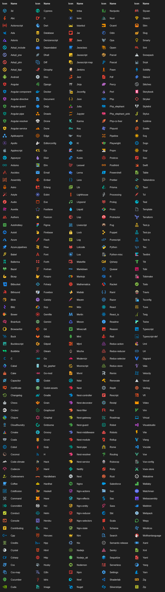
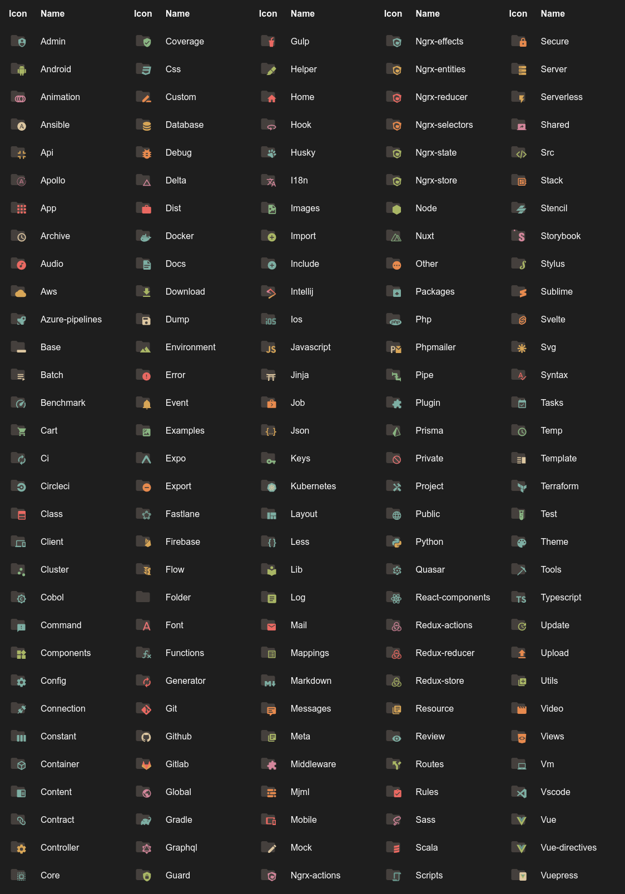

<h1 align="center">
   
    
    
  Icons
   
   
  
</h1>

<h4 align="center">
Get the Icons into your VS Code.
<i>Ported to Zed</i>
</h4>

Port of https://github.com/mazesec/vscode-icons to work with the **Zed** editor

## File icons

### Folder icons

### Contributors

This project exists thanks to all the people who contribute.

